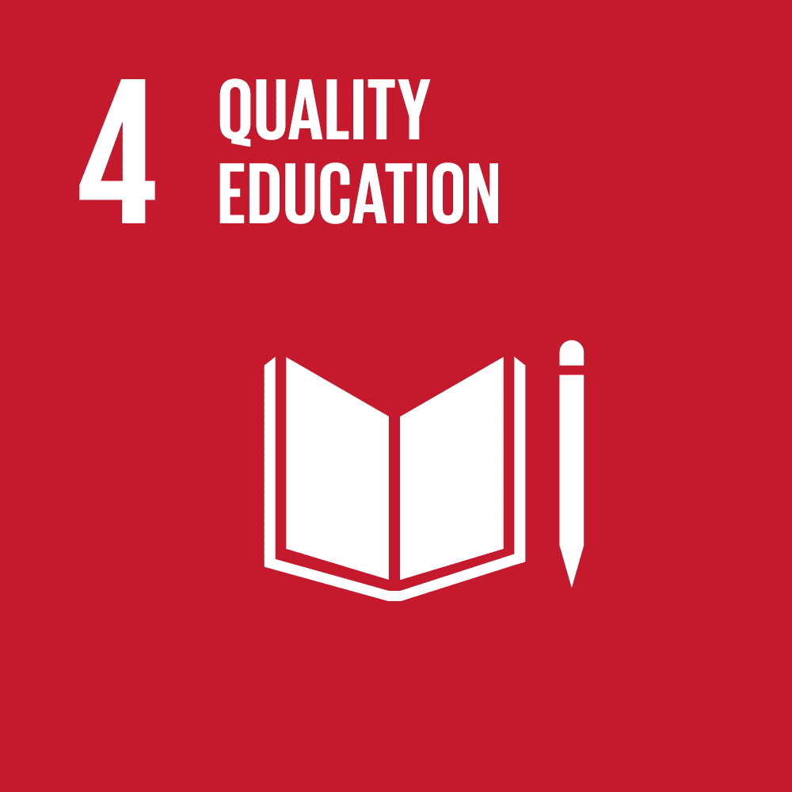

## Table of Contents

1. [Meet the Team](#plogathon-team)
2. [Overview](#overview)
3. [System Architecture](#system-architecture)
4. [Features](#features)
5. [Demo](#presentation-and-demo)
6. [Repository Structure](#repository-structure)
7. [Getting Started](#getting-started)

## Plogathon Team

- Pang Zi Jian Adrian (_2200692_)
- Peter Febrianto Afandy (_2200959_)
- Muhammad Nur Dinie Bin Aziz (_2200936_)
- Tng Jian Rong (_2201014_)
- Lionel Sim Wei Xian (_2201132_)
- Ryan Lai Wei Shao (_2201159_)

## Overview

Plogathon is an innovative mobile application designed to revolutionize waste management and promote recycling through plogging - an exercise introduced in Sweden back in 2016 that combines both jogging and picking up litter. Despite the [increased interest](https://www.straitstimes.com/singapore/environment/plogging-more-keeping-fit-while-clearing-litter) of plogging in Singapore, activities are currently organised using manual means such as Facebook groups. Plogathon aims to streamline this process to promote the adoption of plogging, together with recycling.

Plogathon integrates cutting-edge technologies to guide users to nearby recycling bins for proper waste disposal, as well as machine learning to determine the recyclability of items in real-time during plogging sessions. The mobile application is developed using Flutter to provide a seamless mobile experience, and leverages on cloud-native computing for efficient data processing.

Plogathon aligns with several of the United Nations' Sustainable Development Goals (SDGs), fostering a cleaner planet and advocating for good health and personal well-being.

| Goal                                               | Implementation                                                                                                                                                                                                                                                                                                                                                                                                                                                                                                                                                |
| -------------------------------------------------- | ------------------------------------------------------------------------------------------------------------------------------------------------------------------------------------------------------------------------------------------------------------------------------------------------------------------------------------------------------------------------------------------------------------------------------------------------------------------------------------------------------------------------------------------------------------- |
|  | _**Good Health and Wellbeing**_<br>Plogathon encourages users to engage in physical activities such as running while also cleaning up the environment. Regular physical activity is essential for maintaining good health and preventing various diseases, including heart disease, stroke, diabetes, and various types of cancer. By motivating users to get active outdoors, Plogathon can contribute to improved physical health.                                                                                                                          |
|  | _**Quality Education**_<br>Through Plogathon, users not only participate in physical activities but also learn about recycling and proper waste disposal. When they take photos of recyclable items, Plogathon classifies them and provides information on how to correctly recycle each item. This educational component helps users understand the importance of waste segregation and recycling, fostering environmental stewardship.                                                                                                                      |
|  | _**Responsible Consumption and Production**_<br>Plogathon promotes responsible consumption and production by encouraging users to pick up and properly dispose of litter and recylables. By teaching users how to recycle various materials correctly, Plogathon helps reduce waste and promote recycling, leading to more sustainable consumption patterns. Moreover, by highlighting available recycling bins, Plogathon makes recycling more accessible and convenient, encouraging users to incorporate waste reduction practices into their daily lives. |
|  | _**Climate Action**_<br>By reducing litter and promoting recycling, Plogathon helps decrease the amount of waste that ends up in landfills and incinerators, which are significant sources of greenhouse gas emissions. Moreover, by fostering a culture of sustainability and environmental responsibility, Plogathon can inspire users and communities to adopt more eco-friendly practices in other areas of their lives, contributing to broader efforts to combat climate change.                                                                        |

<p align="center"><i>Join us in creating a Cleaner World for tomorrow, One stride at a time!</i></p>

## System Architecture

Plogathon adopts a microservices-based architecture for better scalability, reliability and performance. It consists of three microservices that are orchestrated together using Docker, and Kubernetes. These microservices work in tandem to support the Plogathon mobile application's operations.

These microservices include:

- Activity Microservice (For Strava operations)
- User Microservice (For user authentication and CRUD operations)
- Classifier Microservice (For maching learning classification of items' materials and their recyclability)

<div align="center">
  
</div>

## Features

<ins>Microservices-based Architecture</ins><br>
Plogathon's adoption of a microservices-based architecture for its backend infrastructure provides several strategic advantages in terms of reliability, scalability, and overall system efficiency. Communication between the frontend and both the user and activity services employs [gRPC](https://grpc.io/), while HTTP is utilized for the interaction between the frontend and the classification service.

<ins>Cloud-Native</ins><br>
Google Kubernetes Engine (GKE) by Google Cloud facilitated the hosting of our Cloud Native Kubernetes Deployment, enabling rapid cluster creation and deployment. Leveraging the cloud platform, it offers centralized server development for the Plogathon project, particularly advantageous for developing mobile Flutter applications where mobility is essential for testing. This approach enhances collaboration and efficiency within the development team.

<ins>Integration with Google's Direction Service API</ins><br>
Google's direction service API is integrated into Plogathon to provide navigation to the nearest recycling bin locations. Leveraging on the robust capabilities of Google Maps API, it calculates the optimal plogging path to guide users towards designated recycling bins where they can recycle materials. Additionally, users can view nearby bins plotted as markers on the map before commencing the plogging activity. During plogging, after picking up a recyclable material, users can also opt to reroute to the nearest bin, enhancing user experience.

<ins>Community Engagement (Integration with Strava)</ins><br>
Strava is one of the most popular applications used for tracking users' physical activity. Plogathon supports Strava Single Sign On (SSO) login to allow users to track and share their plogging activities onto Strava. A Plogathon club has been created in Strava to allow users to initiate group activities and to further engage the community.

<ins>Recyclability Classifier (Machine Learning)</ins><br>
The recyclability classifier is aimed at improving users’ recycling knowledge and educating them on what is recyclable. It takes in an image of a potential recyclable provided by the end user, and outputs the item’s recyclability and proper waste disposal instructions. It consists of two components, the Object Material Type (OMT) classifier, as well as recyclability evaluator. These components work in tandem to provide users with up to date recycling knowledge, educating and aiding them in performing proper waste disposal.

## Presentation and Demo

To see a walkthrough and demonstration of Plogathon, click [here](https://www.youtube.com/watch?v=xCcQqMIoK5c), or scan the QR code below!


## Repository Structure

```
Docker/ (Docker and Kubernetes files)

plog-activity-service/ (code for Activity Microservice)

plog-classify-service/ (code for Classification Microservice)

plog-user-service/ (code for User Microservice)

plogathon/ (code for Flutter-based mobile applciation)

plogathon.sql (SQL migration file for Plogathon's database)

README.md (this file)
```

## Getting Started

### Database Migration

To setup your own MySQL database for this project, follow the instructions below:

1. Ensure that you have MySQL installed on your computing environment. Install MySQL [here](https://dev.mysql.com/downloads/installer/).
2. Run the following command to import the empty MySQL database that has the necessary tables for Plogathon:
   ```
   mysql -u<username> -p < plogathon.sql
   ```
   This command will automatically create the `plogathon` database schema. If you plan on using a different schema (ensure that it is created), run the following command instead:
   ```
   mysql -u<username> -p <schema name> < plogathon.sql
   ```

### Flutter

1. Follow the [instructions](https://docs.flutter.dev/get-started/install) to install Flutter.
2. Install ([`Git LFS`](https://github.com/git-lfs/git-lfs?utm_source=gitlfs_site&utm_medium=installation_link&utm_campaign=gitlfs#installing))

3. `cd` into `plogathon` folder

   ```
   cd plogathon
   ```

4. Copy config file

   ```
   cp env/config-example.json env/config.json
   ```

5. Edit `env/config.json` and add google maps api key
6. Install dependencies

   ```
   flutter pub get
   ```

7. Select your device and run flutter referencing the config file

   ```
   flutter run --dart-define-from-file env/config.json
   ```

8. (Optional) To run in [release mode](https://docs.flutter.dev/testing/build-modes#release)

   ```
   flutter run --dart-define-from-file env/config.json --release
   ```

### Kubernetes Deployment

_Disclaimer: This deployment requires a cloud server to provide external endpoints to the 3 core services. Suggestion: Google Kubernetes Engine(GKE)_

**Prerequistes**

- Have Helm Installed
- Have Kubernetes and Docker Installed

1. Package Helm Chart for deployment
   ```
   helm package Docker/PlogChart
   ```
2. Install and Deploy
   ```
   helm install <name-of-deployment> <packaged-file-name>.tgz
   ```

### Ports and IP Addresses on Google Kubernetes Engine

#### Recycling Classification Service

- **Service Name:** plog-classify-service
- **IP Address:** 34.74.255.72
- **Port:** 5000

#### Activity Service

- **Service Name:** plog-activity-service
- **IP Address:** 34.73.192.194
- **Port:** 5001

#### User Service

- **Service Name:** plog-user-service
- **IP Address:** 35.227.46.182
- **Port:** 5002

### Configuration and Environment Variables

Variables are stored in Config Map and Secrets in the Kubernetes Cluster
