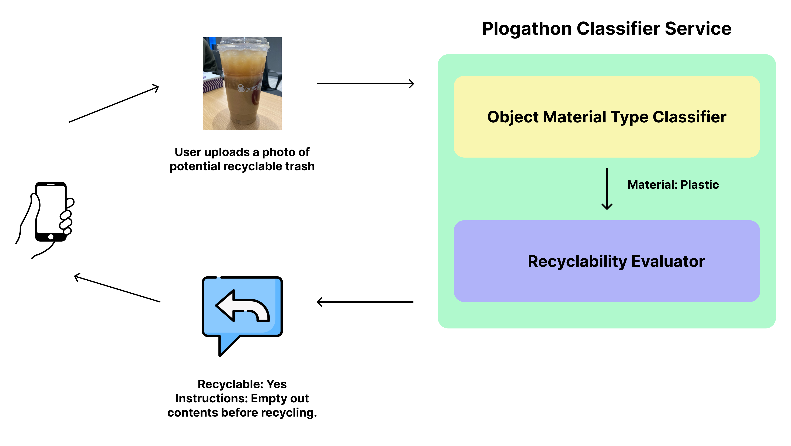
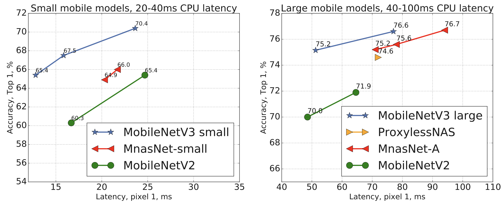
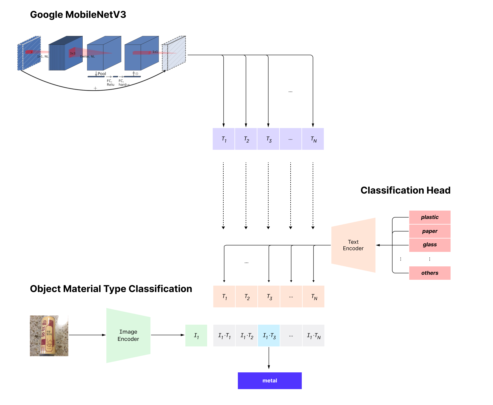
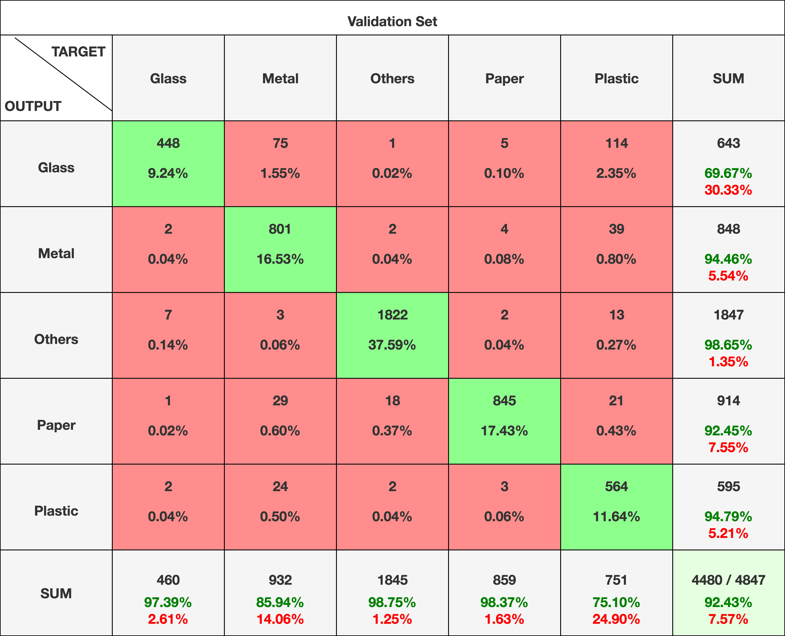
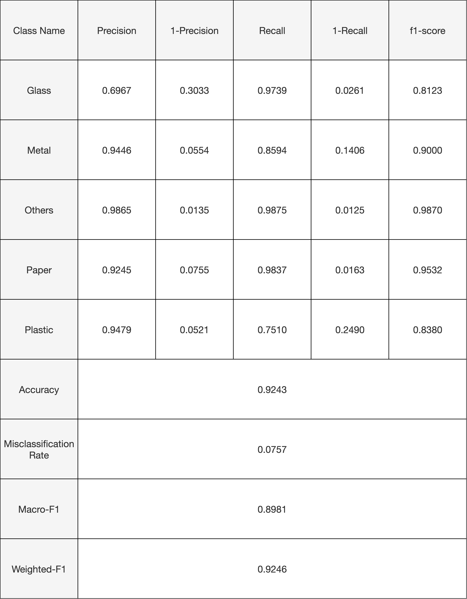

## Table of Contents
1. [Overview](#plogathon-classifier-service)
2. [Directory Structure](#directory-structure)
3. [Program Usage](#program-usage)
4. [Dataset](#dataset)
5. [Object Material Type Classifier](#object-material-type-omt-classifier)
6. [Other Work](#alternative-omt-classifier-built-on-openais-clip)

### Plogathon Classifier Service
---
This section documents the workflow for Plogathon's Classifier Service, and contains source code used for the multi-class classification of images into their corresponding Object Material Type (OMT) classes:
- Paper
- Plastic
- Glass
- Metal
- Others

These classes were intentionally chosen to align with materials identified to be recyclable by the National Environmental Agency (NEA) of Singapore, as documented [here](https://www.nea.gov.sg/docs/default-source/our-services/waste-management/list-of-items-that-are-recyclable-and-not.pdf). 

After classification by the Object Material Type Classification (OMT) model, a subsequent classification on the object's recyclability is performed, based on the data derived from NEA. Instructions on how to prepare the object for recycling are also provided, where appropriate.

An overview of Plogathon's Classifier Service's workflow is illustrated below.



### Directory Structure
---
- `/docs`
    - Documentation images
- `/flask`
    - Server used to provide classification services, and recycling instructions
- `/model`
    - Main model used for (1) Object Material Type classification and (2) Recyclability Evaluation
- `Dockerfile`
    - Used to build classifier service as a Docker-based microservice

```
/docs (contains documentation images)

/flask
    data/ (contains exported models and serialised files)

    templates/ (contains webpages to be served by the server)

    uploads/ (contains user-uploaded images)

    app.py (main Flask program)

    config.py (configuration file)

    utils.py (utility functions)

    requirements.txt (Python dependencies for the Flask server)

/model
    archived/ (contains previous PoC models, specifically OpenAI's CLIP)

    dataset/ (contains dataset used for model training and testing)

    export/ (contains exported models and serialised files)

    common.py (shared utility functions and variables used by the other programs)

    utils.py (utility functions used by the OMT model)

    eda_datasets.ipynb (code for dataset preparation for OMT classification)

    eda_recyclability.ipynb (code for dataset preparations for recyclability evaluation)

    mobilenet_omt.ipynb (code for training and testing the fine-tuned OMT model)

    model_performance.py (program to evaluate performance of the OMT model)

    requirements.txt (Python dependencies for training/testing the OMT model)

Dockerfile (used to run the classifier service within a Docker container for deployment as a microservice)
```

### Program Usage
---
<ins>Model</ins><br>
The final fine-tuned OMT model is available in the `export` folder. However, you can train or test the model by following the instructions below.

1. Create a Python `virtualenv` on your local environment:
    ```
    python3 -m venv .venv
    ```
2. Install the necessary project dependencies, including [TensorFlow](https://www.tensorflow.org/install/pip) (according to your machine's configuration):
    ```
    pip3 install -r requirements.txt
    ```
3. Run the interactive Python notebook to train/test the OMT model, ensuring that you've linked the notebook to the correct Python `virtualenv`.

<br><ins>Flask</ins><br>
To run the Flask server, you can either install and execute the program locally or on a Docker container (preferred) as a microservice:
1. [Docker Installation](#flask-docker-installation)
2. [Local Installation](#flask-local-installation)

#### Flask (Docker Installation)
1. Ensure you have Docker installed on your machine. Click [here](https://docs.docker.com/engine/install/) for installation instructions.
2. Ensure that the Flask server is configured correctly. Modify the `config.py` file to set the desired configurations.
    ```
    # Configurations
    FLASK_HOST = "0.0.0.0"                              # Flask host (listen on all network interfaces to accept incoming connections from any IP address, change to your intended IP address if any)
    FLASK_PORT = "80"                                   # Flask port (change this to your intended exposed port)
    FLASK_THREADED = True                               # Flask threaded option (should be enabled for better performance)
    FLASK_DEBUG = True                                  # Flask debug option (should set to False on production environments)

    # Folders
    DATA_FOLDER = './data'                              # Folder where the pre-trained model and class-mapping information are stored
    UPLOAD_FOLDER = './uploads'                         # Folder to store uploaded images sent by users

    # Files
    class_name_file = f'{DATA_FOLDER}/class_names.pkl'  # Class-mapping information file
    model_file = f'{DATA_FOLDER}/omt_model.keras'       # Pre-trained model
    ```
3. Build the `classifier-server` Docker image by running the following command:
    ```
    sudo docker build -t classifier-server .
    ```
4. Run the `classifier-server` container using the following command:
    ```
    # For an interactive terminal to view output
    sudo docker run -it --name classifier --rm -p 80:80 classifier-server

    # Detached mode
    sudo docker run -d --name classifier --rm -p 80:80 classifier-server
    ```

    Ensure that the `host:container` exposed port is configured as desired. You need to take note of which port is exposed by the host and the address of the host machine, for communications with the edge client devices. 
    
    This final `host:port` address of the classifier server should be correctly configured on the mobile application so that it is able to communicate with the classifier service.

5. Start the web application and use a browser to test the server! 

    If the default `/` endpoint has been enabled for testing, simply enter the classifier server's address on a browser to test the system. A demo of the OMT classifier deployed using Flask is available [here](https://youtu.be/1y3OX_k8ERI).

#### Flask (Local Installation)
1. Install all necessary programs and libraries (`Python` and `Pip`)
    ```
    # Debian-based Linux Installation (perform your own form of installations if installing on another type of device)
    sudo apt update
    sudo apt-get -y install python3 python3-pip python3-venv
    ```
2. Create a `virtualenv` for the project
    ```
    python3 -m venv .venv
    source .venv/bin/activate
    ```
3. Install the necessary project dependencies
    ```
    # Python (preferred due to interdependencies required by Tensorflow)
    pip3 install -U flask flask-cors tensorflow

    OR

    # Ensure you are within the directory with requirements.txt
    pip3 install -r requirements.txt 
    ```
4. Ensure that the Flask server is configured correctly. Modify the `config.py` file to set the desired configurations.
    ```
    # Configurations
    FLASK_HOST = "0.0.0.0"                              # Flask host (listen on all network interfaces to accept incoming connections from any IP address, change to your intended IP address if any)
    FLASK_PORT = "80"                                   # Flask port (change this to your intended exposed port)
    FLASK_THREADED = True                               # Flask threaded option (should be enabled for better performance)
    FLASK_DEBUG = True                                  # Flask debug option (should set to False on production environments)

    # Folders
    DATA_FOLDER = './data'                              # Folder where the pre-trained model and class-mapping information are stored
    UPLOAD_FOLDER = './uploads'                         # Folder to store uploaded images sent by users

    # Files
    class_name_file = f'{DATA_FOLDER}/class_names.pkl'  # Class-mapping information file
    model_file = f'{DATA_FOLDER}/omt_model.keras'       # Pre-trained model
    ```
5. Run the Flask server
    ```
    sudo python3 app.py
    ```
6. If you are just testing the Flask server, navigate to the the `/` endpoint on a web browser to view the testing page. A demo of the OMT classifier deployed using Flask is available [here](https://youtu.be/1y3OX_k8ERI).

### Dataset
---
The OMT model is trained on a combination of both the (1) [Garbage Classification](https://www.kaggle.com/datasets/mostafaabla/garbage-classification) and (2) [Recycle Classification](https://www.kaggle.com/datasets/jinfree/recycle-classification-dataset) datasets available on Kaggle. These datasets were combined together to fit into the five classes of materials available for classification by the OMT model.

The (1) Garbage Classification dataset consists of 12 initial classes that were re-arranged to fit into the five material classes:
- Paper
    - Cardboard
- Plastic
- Glass
    - Brown Glass
    - Green Glass
    - White Glass
- Metal
- Others
    - Battery
    - Biological
    - Clothes
    - Shoes
    - Trash

The (2) Recycle Classification dataset consists of 4 initial classes that were re-arranged to fit into the five material classes:
- Paper
- Plastic
- Glass
- Metal
    - can

Both datasets consist of random yet realistic transformations on images of objects, including rotation and distortions, which exposes the model to different aspects of training data, reducing the chances of overfitting. 

After preprocessing and combining both datasets, the final dataset consists of the following distribution of images:
```
Paper      4571
Plastic    2975
Metal      4242
Glass      3215
Others     9232
```

The combined dataset is available for download [here](https://gla-my.sharepoint.com/:u:/g/personal/2837303a_student_gla_ac_uk/Ed0pU32-uYNKuzjscVhZlPUBdGtgnoB8dJU5axo5vC_xiw?e=SqkfpJ) (password: `plogathon-2024`).

### Object Material Type (OMT) Classifier
The OMT classification model is built on Google's [MobileNetV3](https://blog.research.google/2019/11/introducing-next-generation-on-device.html) model, which is trained on the ImageNet dataset, which consists of 1.4 million images, and capable of classifying more than 1000 object types. The MobileNetV3 model is optimised for computer vision applications in resource-constrained environments and boasts better performance, when compared to state-of-the-art models such as MnasNet and ProxylessNet.


*Source: Google MobileNetV3 [(Howard et. al., 2019)](https://arxiv.org/pdf/1905.02244.pdf)*

The OMT model is built by training and attaching a classification head on top of the MobileNet model, which serves as the Base Neural Network (BNN), to facilitate transfer learning. This enables the new classification head to leverage on the learnings of MobileNet as the BNN, allowing for faster training and better model performance. The BNN's pre-trained layers are frozen and function as intermediate layers to extract data features. These features are then fed onto the subsequent classification head's NN layers for further classification. An overview of the OMT model's architecture is provided below.


*Adapted from Google's MobileNetV3 [(Howard et. al., 2019)](https://arxiv.org/pdf/1905.02244.pdf)*

<pre style="white-space:pre;overflow-x:auto;line-height:normal;font-family:Menlo,'DejaVu Sans Mono',consolas,'Courier New',monospace">┏━━━━━━━━━━━━━━━━━━━━━━━━━━━━━━━━━┳━━━━━━━━━━━━━━━━━━━━━━━━┳━━━━━━━━━━━━━━━┓
┃<span style="font-weight: bold"> Layer (type)                    </span>┃<span style="font-weight: bold"> Output Shape           </span>┃<span style="font-weight: bold">       Param # </span>┃
┡━━━━━━━━━━━━━━━━━━━━━━━━━━━━━━━━━╇━━━━━━━━━━━━━━━━━━━━━━━━╇━━━━━━━━━━━━━━━┩
│ input_layer_1 (<span style="color: #0087ff; text-decoration-color: #0087ff">InputLayer</span>)      │ (<span style="color: #00d7ff; text-decoration-color: #00d7ff">None</span>, <span style="color: #00af00; text-decoration-color: #00af00">224</span>, <span style="color: #00af00; text-decoration-color: #00af00">224</span>, <span style="color: #00af00; text-decoration-color: #00af00">3</span>)    │             <span style="color: #00af00; text-decoration-color: #00af00">0</span> │
├─────────────────────────────────┼────────────────────────┼───────────────┤
│ sequential (<span style="color: #0087ff; text-decoration-color: #0087ff">Sequential</span>)         │ (<span style="color: #00d7ff; text-decoration-color: #00d7ff">None</span>, <span style="color: #00af00; text-decoration-color: #00af00">224</span>, <span style="color: #00af00; text-decoration-color: #00af00">224</span>, <span style="color: #00af00; text-decoration-color: #00af00">3</span>)    │             <span style="color: #00af00; text-decoration-color: #00af00">0</span> │
├─────────────────────────────────┼────────────────────────┼───────────────┤
│ MobilenetV3small (<span style="color: #0087ff; text-decoration-color: #0087ff">Functional</span>)   │ (<span style="color: #00d7ff; text-decoration-color: #00d7ff">None</span>, <span style="color: #00af00; text-decoration-color: #00af00">7</span>, <span style="color: #00af00; text-decoration-color: #00af00">7</span>, <span style="color: #00af00; text-decoration-color: #00af00">576</span>)      │       <span style="color: #00af00; text-decoration-color: #00af00">939,120</span> │
├─────────────────────────────────┼────────────────────────┼───────────────┤
│ global_average_pooling2d        │ (<span style="color: #00d7ff; text-decoration-color: #00d7ff">None</span>, <span style="color: #00af00; text-decoration-color: #00af00">576</span>)            │             <span style="color: #00af00; text-decoration-color: #00af00">0</span> │
│ (<span style="color: #0087ff; text-decoration-color: #0087ff">GlobalAveragePooling2D</span>)        │                        │               │
├─────────────────────────────────┼────────────────────────┼───────────────┤
│ dense (<span style="color: #0087ff; text-decoration-color: #0087ff">Dense</span>)                   │ (<span style="color: #00d7ff; text-decoration-color: #00d7ff">None</span>, <span style="color: #00af00; text-decoration-color: #00af00">1024</span>)           │       <span style="color: #00af00; text-decoration-color: #00af00">590,848</span> │
├─────────────────────────────────┼────────────────────────┼───────────────┤
│ dense_1 (<span style="color: #0087ff; text-decoration-color: #0087ff">Dense</span>)                 │ (<span style="color: #00d7ff; text-decoration-color: #00d7ff">None</span>, <span style="color: #00af00; text-decoration-color: #00af00">1024</span>)           │     <span style="color: #00af00; text-decoration-color: #00af00">1,049,600</span> │
├─────────────────────────────────┼────────────────────────┼───────────────┤
│ dense_2 (<span style="color: #0087ff; text-decoration-color: #0087ff">Dense</span>)                 │ (<span style="color: #00d7ff; text-decoration-color: #00d7ff">None</span>, <span style="color: #00af00; text-decoration-color: #00af00">512</span>)            │       <span style="color: #00af00; text-decoration-color: #00af00">524,800</span> │
├─────────────────────────────────┼────────────────────────┼───────────────┤
│ batch_normalization             │ (<span style="color: #00d7ff; text-decoration-color: #00d7ff">None</span>, <span style="color: #00af00; text-decoration-color: #00af00">512</span>)            │         <span style="color: #00af00; text-decoration-color: #00af00">2,048</span> │
│ (<span style="color: #0087ff; text-decoration-color: #0087ff">BatchNormalization</span>)            │                        │               │
├─────────────────────────────────┼────────────────────────┼───────────────┤
│ dropout (<span style="color: #0087ff; text-decoration-color: #0087ff">Dropout</span>)               │ (<span style="color: #00d7ff; text-decoration-color: #00d7ff">None</span>, <span style="color: #00af00; text-decoration-color: #00af00">512</span>)            │             <span style="color: #00af00; text-decoration-color: #00af00">0</span> │
├─────────────────────────────────┼────────────────────────┼───────────────┤
│ dense_3 (<span style="color: #0087ff; text-decoration-color: #0087ff">Dense</span>)                 │ (<span style="color: #00d7ff; text-decoration-color: #00d7ff">None</span>, <span style="color: #00af00; text-decoration-color: #00af00">5</span>)              │         <span style="color: #00af00; text-decoration-color: #00af00">2,565</span> │
└─────────────────────────────────┴────────────────────────┴───────────────┘
</pre>

Upon testing, the OMT model was able to produce a desirable training accuracy of `92.91%` and test accuracy of `92.43%`. Other metrics measuring the model's peformance for both the train and test datasets are provided below.




```
~Test Dataset Results~
Accuracy: 0.9242830616876418
Precision: 0.911117925278066
Recall: 0.9000361772380904
F1 Score: 0.8981108495712979
Matthews Correlation Coefficient (MCC): 0.9016064870560931
Cohen's Kappa: 0.899882465882997
Hamming Loss: 0.07571693831235816

Confusion Matrix:
 [[ 448   75    1    5  114]
 [   2  801    2    4   39]
 [   7    3 1822    2   13]
 [   1   29   18  845   21]
 [   2   24    2    3  564]]

Classification Report:
               precision    recall  f1-score   support

       Glass       0.97      0.70      0.81       643
       Metal       0.86      0.94      0.90       848
      Others       0.99      0.99      0.99      1847
       Paper       0.98      0.92      0.95       914
     Plastic       0.75      0.95      0.84       595

    accuracy                           0.92      4847
   macro avg       0.91      0.90      0.90      4847
weighted avg       0.93      0.92      0.92      4847

-------------------------------------------------------------

~Train Dataset Results~
Accuracy: 0.9290798432019806
Precision: 0.9158729171522368
Recall: 0.9075305952687653
F1 Score: 0.9055970542633197
Matthews Correlation Coefficient (MCC): 0.9077014131522007
Cohen's Kappa: 0.9062726342921608
Hamming Loss: 0.0709201567980194

Confusion Matrix:
 [[1892  267    8   15  390]
 [   6 3171    6   11  200]
 [  24   25 7288   20   28]
 [   2   97   53 3395  110]
 [   7   87    7   12 2267]]

Classification Report:
               precision    recall  f1-score   support

       Glass       0.98      0.74      0.84      2572
       Metal       0.87      0.93      0.90      3394
      Others       0.99      0.99      0.99      7385
       Paper       0.98      0.93      0.95      3657
     Plastic       0.76      0.95      0.84      2380

    accuracy                           0.93     19388
   macro avg       0.92      0.91      0.91     19388
weighted avg       0.94      0.93      0.93     19388
```

### Alternative: OMT Classifier built on OpenAI's CLIP
---
Another alternative to the current OMT model would be to build the model on top of OpenAI's [CLIP](https://openai.com/research/clip) model using transfer learning for the multi-class classification of images of objects as `Paper`, `Plastic`, `Metal`, `Glass` and `Others`. CLIP is a multi-modal neural network trained on 400 million image-text (text caption) pairs from the Internet, making it suitable for multiple use-cases including image classification, generation and ranking. CLIP boasts on-par or better performance without prior training as a generalised zero-shot classifier, when compared against other traditionally trained supervised models.


*Source: OpenAI CLIP [(Radford et. al., 2021)](https://arxiv.org/pdf/2103.00020.pdf)*

However, CLIP was unable to produce desirable results for multi-class classification of object material types, which is likely due to its lack of generalisation to such images during its pre-training. Initial testing on the dataset resulted in the highest accuracy of *72.01%* and precision of *73.49%* when performing as a zero-shot classifier. 

Initial testing of CLIP's nine models as zero-shot classifiers (without prior training) on the dataset revealed that the `ViT-L/14` model performed the best on both a 1% and 10% stratified sample of the dataset. Stratified samples of the dataset were used to speed up initial testing and fine-tuning of the model. The `ViT-L/14` model's performance, when tested against a 10% stratified sample of the dataset, is provided illustrated below:
```
Model: ViT-L/14
Model parameters: 427,616,513
Input resolution: 224
Context length: 77
Vocab size: 49408

Accuracy: 0.720164609053498
Precision: 0.734947393591583
Recall: 0.7138424998330328
F1 Score: 0.703695785990944
Matthews Correlation Coefficient (MCC): 0.640289920044027
Cohen's Kappa: 0.6349013455887227
Hamming Loss: 0.27983539094650206

Confusion Matrix:
 [[70  9  0  0 14]
 [ 4 35  6  0  1]
 [ 2  2 26  0  0]
 [ 5  0  8 19  0]
 [ 1  5 11  0 25]]

Classification Report:
               precision    recall  f1-score   support

           0       0.85      0.75      0.80        93
           1       0.69      0.76      0.72        46
           2       0.51      0.87      0.64        30
           3       1.00      0.59      0.75        32
           4       0.62      0.60      0.61        42

    accuracy                           0.72       243
   macro avg       0.73      0.71      0.70       243
weighted avg       0.76      0.72      0.73       243
```

Prompt engineering on the text captions provided to the base CLIP model were also performed, revealing optimal performance using text prompts (ontologies) following the convention `a photo of an object made of <material>`. 

For instance, the following ontologies were tested:
- `<material>` (44.03% Accuracy, 49.70% Precision)
- `object made of <material>` (52.26% Accuracy, 57.56% Precision)
- `a picture of an object made of <material>` (68.31% Accuracy, 70.44% Precision)
- `a photo of an object made of <material>`  (**Optimal**: 72.01% Accuracy, 73.49% Precision)

Expressing appropriate class descriptions to CLIP is essential to fine-tuning its performance, as it enables us to leverage on the richness of its pre-training procedures. The optimised text prompts for each of the five material type classes are provided below, with a special exception for the `Others` class.
```
Paper: a photo of an object made of paper

Plastic: a photo of an object made of plastic

Glass: a photo of an object made of glass

Metal: a photo of an object made of metal

Others: a photo of an object made of anything other than paper, plastic, glass, or metal
```

To further optimise CLIP for OMT classification, we propose the application of transfer learning by training and attaching a classification head on top of CLIP, which acts as the Base Neural Network (BNN). This would enable the new classification head to leverage on the learnings of CLIP as the BNN, allowing for faster training and better model performance. However, due to the hardware requirements (A100 GPU) for fine-tuning or training a new classifier based on CLIP (as demonstrated [here](https://github.com/mlfoundations/open_clip/blob/main/docs/PRETRAINED.md)), we were unable to test this out. Source code demonstrating tests on the CLIP model can be found in the `archived/clip` folder.


*Adapted from OpenAI's CLIP [(Radford et. al., 2021)](https://arxiv.org/pdf/2103.00020.pdf)*